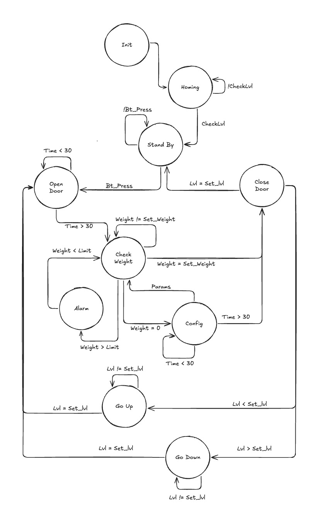

# TP_INT_INFO_2

Realizado por Lara Diaz Steinbrecher 

## Ascensor de carga

El proyecto será realizado en Lenguaje C, utilizando una Raspberry Pi Pico, para el control de un ascensor de carga con regulador de peso. El ascensor recibirá datos del usuario (Piso destino, peso e información de los paquetes de carga) y de un sensor de peso, mientras los datos cargados coincidan con el peso dentro del ascensor, este llegará al destino requerido; En caso contrario, al superar un limite establecido, se activará una alarma.

## Diagrama de Maquina de Estado

